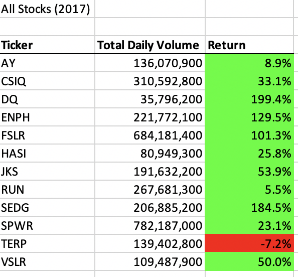
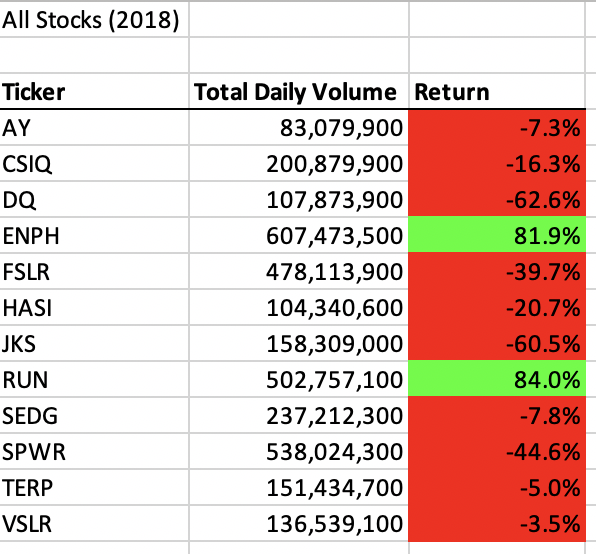
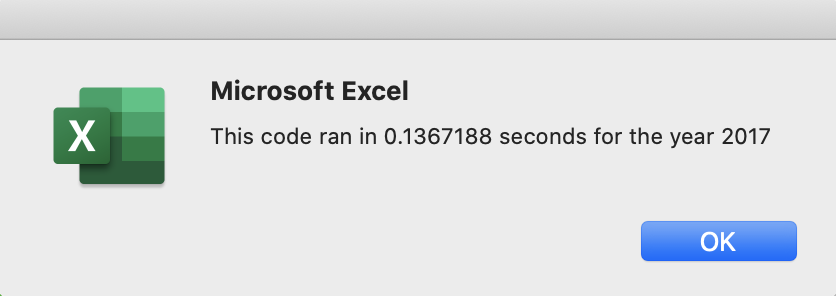
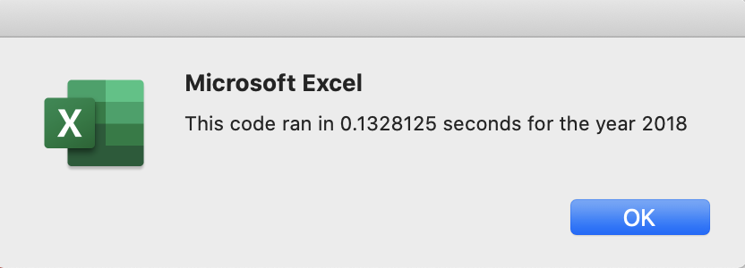
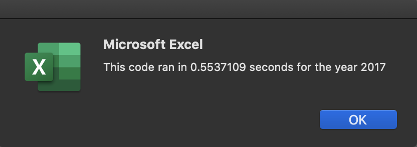
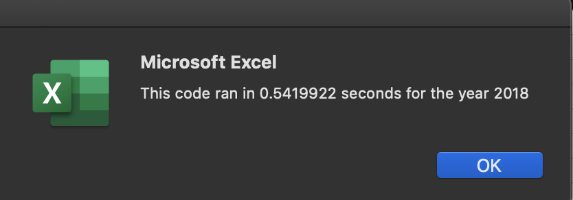

# Green Stock Analysis

## Overview of Project
<p>
The study looked at a dataset of daily volume traded and daily closing prices of 12 green energy stocks in the years 2017 and 2018. The analysis utilized VBA Macros to efficiently calculate the total volume of trades for each stock in a given year. The annual return for each stock was also determined by measuring the growth of its closing price from the start of year to the end of the year. 
</p>
<p>
The goal is to help investors determine whether DAQO New Energy corporation (ticker: DQ), a company that makes silicon wafers for solar panels, is worth investing in. 
</p>

## Results
### Analysis of 2017 Stock Prices
<br>
</img>
</br>
<p>
In 2017, all of the green energy stocks in the dataset experienced a positive annual growth with the exception of TERP whose stock price decreased by 7.2%. This trend indicates that 2017 is a genrally lucrative year for investing in companies that produce green energy. With a 199.4% growth rate since the beginning of the year, the DQ stock price has almost tripled its initial value by the end of 2017. However, DQ also has the lowest total trading volume in 2017 among the stocks in the dataset. Investors who buy low volume stocks may find it difficult to sell it later because of the lack of liquidity.

### Analysis of 2018 Stock Prices
<br>
</img>
</br>
<p>
Most of the green stocks that experienced a positive growth in 2017 decreased in value in 2018. Among them is DQ which exhibited a 62.6% decline in value by the end of 2018. Considering its contrasting performance in 2017, DQ stock price behaviour is extremely volatile. Along with its low liquidity from its low trading volume, DQ stock can be a risky investment. Therefore, investors should strongly consider diversifying their portfolio of green investments to other companies such as ENPH and RUN. Both of their stock prices experienced consecutive positive growth rates in 2017 and 2018. This suggests that investors have a sustained optimistic outlook regarding the future cash flows of these companies. In addition, both of these stocks have a higher trading volume relative to the others. This implies that investors can easily resell these stocks in an active trading market and quickly realize any potential gains. 

### Refactored VBA Code Used for Analysis
<p>
The analysis mainly relied on a nested for loop that went through the data row by row. Each iteration of the loop collected information regarding the daily volume traded as well as the starting and ending close prices of the stock ticker concerned. The relevant information was then stored into arrays. At the end of the loop, the information contained in these arrays was used to to populate the cells on the All Stocks Analysis Sheet. 
</p>
<br>

```
Sub AllStocksAnalysisRefactored()
    Dim startTime As Single
    Dim endTime  As Single

    yearValue = InputBox("What year would you like to run the analysis on?")

    startTime = Timer
    
    'Format the output sheet on All Stocks Analysis worksheet
    Worksheets("All Stocks Analysis").Activate
    
    Range("A1").Value = "All Stocks (" + yearValue + ")"
    
    'Create a header row
    Cells(3, 1).Value = "Ticker"
    Cells(3, 2).Value = "Total Daily Volume"
    Cells(3, 3).Value = "Return"

    'Initialize array of all tickers
    Dim tickers(12) As String
    
    tickers(0) = "AY"
    tickers(1) = "CSIQ"
    tickers(2) = "DQ"
    tickers(3) = "ENPH"
    tickers(4) = "FSLR"
    tickers(5) = "HASI"
    tickers(6) = "JKS"
    tickers(7) = "RUN"
    tickers(8) = "SEDG"
    tickers(9) = "SPWR"
    tickers(10) = "TERP"
    tickers(11) = "VSLR"
    
    'Activate data worksheet
    Worksheets(yearValue).Activate
    
    'Get the number of rows to loop over
    RowCount = Cells(Rows.Count, "A").End(xlUp).Row
    
    '1a) Create a ticker Index
    tickerIndex = 0

    '1b) Create three output arrays
    Dim tickerVolumes(12) As Long
    Dim tickerStartingPrices(12) As Single
    Dim tickerEndingPrices(12) As Single
    
    ''2a) Create a for loop to initialize the tickerVolumes to zero.
    
    For i = 0 To 11
        tickerVolumes(i) = 0
    Next i
    
    ''2b) Loop over all the rows in the spreadsheet.
    For i = 2 To RowCount
        
        '3a) Increase volume for current ticker
        tickerVolumes(tickerIndex) = tickerVolumes(tickerIndex) + Cells(i, 8).Value
        
        '3b) Check if the current row is the first row with the selected tickerIndex.
       
        If Cells(i, 1).Value = tickers(tickerIndex) And Cells(i - 1, 1) <> tickers(tickerIndex) Then
            tickerStartingPrices(tickerIndex) = Cells(i, 6).Value
        End If
        
        '3c) check if the current row is the last row with the selected ticker
         'If the next row’s ticker doesn’t match, increase the tickerIndex.
    
        If Cells(i, 1).Value = tickers(tickerIndex) And Cells(i + 1, 1) <> tickers(tickerIndex) Then
            tickerEndingPrices(tickerIndex) = Cells(i, 6).Value

            '3d Increase the tickerIndex.
            tickerIndex = tickerIndex + 1
                
        End If
    
    Next i
    
    '4) Loop through your arrays to output the Ticker, Total Daily Volume, and Return.
    For i = 0 To 11
    
        Worksheets("All Stocks Analysis").Activate
        
        Cells(i + 4, 1).Value = tickers(i)
        Cells(i + 4, 2).Value = tickerVolumes(i)
        Cells(i + 4, 3).Value = (tickerEndingPrices(i) / tickerStartingPrices(i)) - 1
        
    Next i
    
    'Formatting
    Worksheets("All Stocks Analysis").Activate
    Range("A3:C3").Font.FontStyle = "Bold"
    Range("A3:C3").Borders(xlEdgeBottom).LineStyle = xlContinuous
    Range("B4:B15").NumberFormat = "#,##0"
    Range("C4:C15").NumberFormat = "0.0%"
    Columns("B").AutoFit

    dataRowStart = 4
    DataRowEnd = 15

    For i = dataRowStart To DataRowEnd
        
        If Cells(i, 3) > 0 Then
            
            Cells(i, 3).Interior.Color = vbGreen
            
        Else
        
            Cells(i, 3).Interior.Color = vbRed
            
        End If
        
    Next i
 
    endTime = Timer
    MsgBox "This code ran in " & (endTime - startTime) & " seconds for the year " & (yearValue)

End Sub
```
<br>

### Run Time Changes due to Refactored Code 
<p>
The refactored script is more efficient than the original becasue it saved about 0.4 seconds in run time.  
</p>

**<center>Run Times of Refactored Script</center>**
</img>
<br>
</img>
<br>
<br>
**<center>Run Times of Original Script (Before Refactoring)</center>**
</img>
<br>
</img>

# Summary
## Advantages and Disadvantages of Refactoring In General
<p>
Refactoring code is a great way to edit another programmer's work by simplifying complex instructions and processes. By making conditionals more comprehensive and by simplifying the iterative process of most for loops, code can be made more efficient as run times can be reduced.
</p>
<p>
Refactoring is also helpful in testing another person's code. Sometimes, original scripts will only work in some cases and fail in others. By checking existing code against several test cases, refactoring will help programmers incorporate them into the conditionals of a code. This improves the code by making it more applicable towards a broader set of circumstances. 
</p>
<p>
The disadvantge of refactoring is the risk of introducing unintended bugs into an already functional set of code. These bugs could come in the form of syntax errors or even logic errors wherein for loops or conditionals are not functioning properly. 
</p>
<p>
Another disadvantage of refactoring is the widely varying cost and benefit of doing so. Spending resources to  refactor code may not be worth it if the resulting improvements are marginal at best. For example, if a programmer spends hours refactoring code only to save an insignificant amount of milliseconds in run time then the cost of refactoring exceeds its benefit. 

## Pros and Cons of Refactoring Original VBA Script 
<p>
The original script involves a nested for loop whose outer loop goes through each row of the stock data of the year concerned. Variables such as total volume, starting closing price, and ending closing price are initialized to either zero or empty prior to the inner for loop. The inner for loop then uses a set of conditionals to check for and update these variables. Once this finishes, the updated variables are used to populate one row of the All Stocks Analysis worksheet with the total volume traded and calculated return of one stock. The variables are then reinitialized to either zero or empty before the process repeats again for the next stock in the data. 
</p>
<p>
The refactored script is similar in structure except that several arrays of size 12 were initialized prior to the nested for loop. These arrays were designed to hold the total volume traded, starting stock price and ending stock price for the 12 stocks in the data. 
</p>
<p>
One big advantage of refactoring the script this way is the reduction in the run time of the overall code. The for loop of the original script goes back and forth between the data and the All Stocks Analysis worksheet. Meanwhile, the refactored code tells Excel to continue going through the rows of the data worksheet without leaving it. This is becasue the arrays are updated with relevant information with every iteration of the loop instead of the All Stocks Analysis worksheet. With the refactored code, the All Stocks Analysis worksheet is only activated and updated once the arrays are filled with the relevant information for all 12 stocks. 
</p>
<p>
One disadvantage of the refactored code is that another for loop must be written down in order to access the stored information in the arrays and place them in the appropriate cells of the All Stocks Analysis Worksheet. That and the creation of our arrays are extra lines of code that need to be written for a marginal 0.4 second improvement in run time. 
</p>


